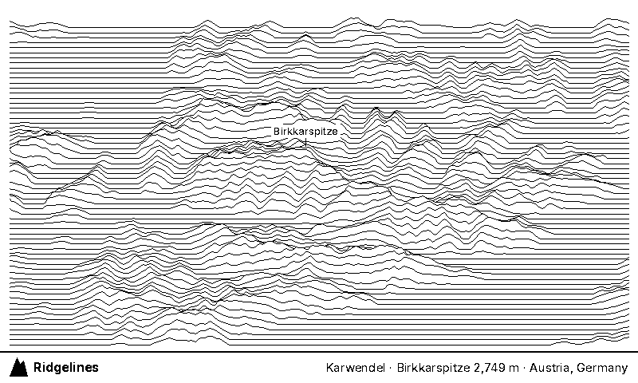

# Ridgelines

A [TRMNL](https://trmnl.com) recipe that shows one real mountain range per day, drawn as a top-down map of gently rippled lines.

**Status:** in design, not released.

Planned data: elevation from Copernicus DEM GLO-90, the list of ranges and their names from Wikidata. The mockups above use JAXA AW3D30 demo terrain tiles published by MapLibre, because they were the real data reachable while designing.

## What's here

| Path | Contents |
| --- | --- |
| [PROJECT.md](PROJECT.md) | Status, planned architecture, decisions, dated findings, next steps |
| [CLAUDE.md](CLAUDE.md) | Rules for coding agents working in this repo |
| [docs/brief.md](docs/brief.md) | Full brief and requirements |
| [docs/mockups/](docs/mockups/) | Look exploration and the chosen direction |
| [tools/mockup/](tools/mockup/) | Script that renders TRMNL-sized mockups from real terrain |
