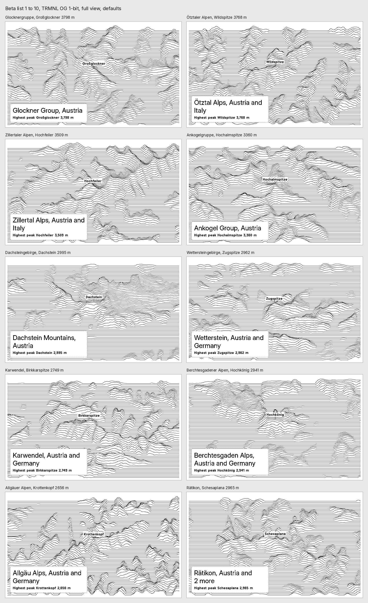

# Ridgelines

A [TRMNL](https://trmnl.com) recipe that shows one real mountain range per day, drawn as a top-down map of gently rippled lines.

**Status:** store release in progress. 365 ranges for Europe picked and in review; Americas, Asia and Oceania, and Africa to follow. The beta (30 ranges in Germany and Austria) is still served from GitHub Pages.



Data: elevation from Copernicus DEM GLO-90, the list of ranges and their names from Wikidata. See [recipe/settings.yml](recipe/settings.yml) for the notices.

## What's here

| Path | Contents |
| --- | --- |
| [PROJECT.md](PROJECT.md) | Status, architecture, decisions, dated findings, next steps |
| [CLAUDE.md](CLAUDE.md) | Rules for coding agents working in this repo |
| [docs/brief.md](docs/brief.md) | Full brief and requirements |
| [recipe/](recipe/) | The TRMNL plugin: settings, Polling URL, Liquid templates (`.txt`), install steps |
| [data/beta_de_at.json](data/beta_de_at.json) | The curated beta list |
| [pipeline/](pipeline/) | Builds entries from Copernicus and Wikidata (`entries.py`) and the Pages site (`publish.py`) |
| [.github/workflows/site.yml](.github/workflows/site.yml) | Builds and deploys the site to GitHub Pages |
| [docs/mockups/](docs/mockups/) | Look exploration and contact sheets |
| [tools/mockup/](tools/mockup/) | Renders the recipe templates through the TRMNL framework for review |

## Building locally

```
pip install -r pipeline/requirements.txt
python pipeline/candidates.py         # counts per area (cached Wikidata queries in .cache/)
python pipeline/select.py europe      # picks 365 ranges into data/release/europe.json
python pipeline/publish.py            # writes site/ (git-ignored) and recipe/polling_url.txt
python pipeline/test_polling_url.py   # needs ruby and the liquid gem 5.14.0
```

Elevation tiles land in `.cache/glo90/` (about 4 MB each, never committed).
